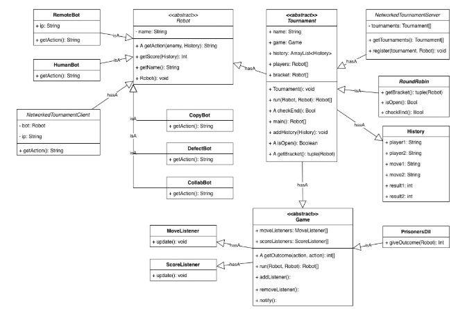

# Distributed Tournament Simulation System

A distributed, API-driven tournament framework that simulates competitive gameplay between autonomous agents ("bots") using a client-server architecture designed through RESTful.

---

## 🚀 Overview

This system enables multiple remote agents to participate in automated tournaments. Bots communicate with a central server via REST APIs to exchange game actions and match history.

Key features:

* Client-server architecture using Spring Boot
* RESTful API communication between distributed agents
* Extensible object-oriented design for games and tournament types
* Automated round-robin tournament scheduling

---

## 🏗️ System Architecture

### Components:

* **Server**: Manages tournaments, player registration, and match execution
* **Client Bots**: Independent agents that respond to game state via API
* **Game Engine**: Handles game logic (e.g., Prisoner’s Dilemma)

---

## 🔌 API Design

### Bot Endpoints

#### `GET /robot/action`

Returns the bot's next action.

#### `POST /robot/match`

Receives match history and updates bot state.

### Server Endpoints

#### `GET /tournaments/available`

Returns list of available tournaments

#### `POST /tournaments/register`

Registers a bot to a tournament

---

## ⚙️ Technologies Used

* Java
* Spring Boot
* REST APIs
* JSON (data exchange)

---

## 🧠 Key Design Decisions

* **REST-based communication** enables distributed bot participation
* **Abstract game/tournament classes** allow extensibility
* **Round-robin scheduling** ensures all agents compete
* **State tracking via structured objects** (RoundInfo, MatchInfo)

---

## ▶️ How It Works

1. Bots register with the server
2. Server schedules matches
3. Bots receive match history via API
4. Bots return actions
5. Game engine processes outcomes
6. Tournament progresses automatically

---

## 📦 Example Use Case

Simulate a Prisoner’s Dilemma tournament between multiple bots with different strategies (always cooperate, always defect, random, etc.).

---

## 📈 Future Improvements

* Add support for additional games
* Implement tournament visualization via JavaFX
* Introduce an account system and a database backing
* Introduce a chat function for spectators
* Allow the ability to gamble a fake currency on tournament results

---

## 👤 Author

Nathan Varner
[GitHub](https://github.com/Varnern23)
